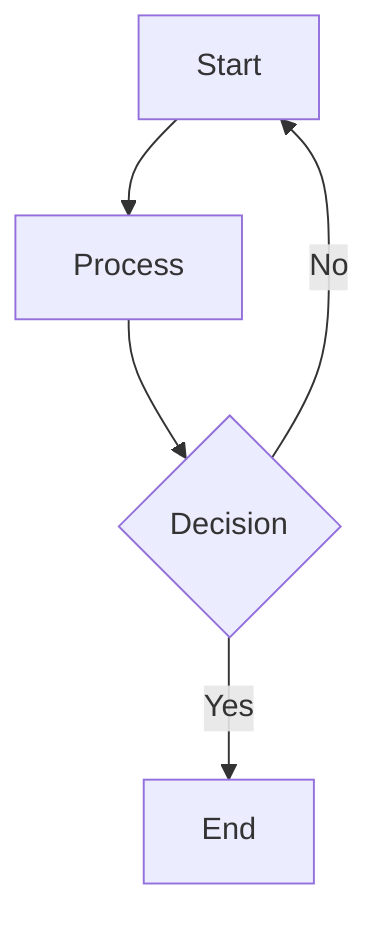
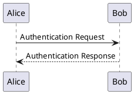

# Markdown Features

browsemark supports [CommonMark](https://commonmark.org/) and [GitHub Flavored Markdown](https://github.github.com/gfm/) (tables, task lists, strikethrough, autolinks). This page covers the additional features beyond standard markdown.

## Wiki-Links (Obsidian-Compatible)

Link between markdown files using wiki-link syntax:

```markdown
[[another-file]]
[[another-file|Display Text]]
[[another-file#heading]]
```

Links resolve against your file tree automatically. Supports display text aliases and heading anchors.

> **Note:** `![[embed]]` syntax (transclusion) is not supported. Embedded note references render as plain text.

## Mermaid Diagrams

````markdown

````

## PlantUML Diagrams

````markdown

````

Supports both `plantuml` and `puml` language identifiers. Diagrams are rendered server-side by the local browsemark server. No internet connection required.

## Math (KaTeX)

```markdown
$$
L = \frac{1}{2} \rho v^2 S C_L
$$

Inline math: $E = mc^2$
```

Both block-level and inline mathematical expressions are supported.

## GitHub-Style Alerts

```markdown
> [!NOTE]
> This is a note.

> [!TIP]
> This is a tip.

> [!IMPORTANT]
> This is important.

> [!WARNING]
> This is a warning.

> [!CAUTION]
> This is a caution.
```

## Frontmatter

YAML metadata at the top of a file is displayed in a separate **Frontmatter** tab alongside the Preview and Raw tabs. The tab only appears when frontmatter is present.

```yaml
---
title: "Sample Doc"
author: "Jane Doe"
tags: ["browsemark", "docs"]
---
```

## Syntax Highlighting

Fenced code blocks are highlighted automatically. Choose from over 40 syntax themes in Settings.
