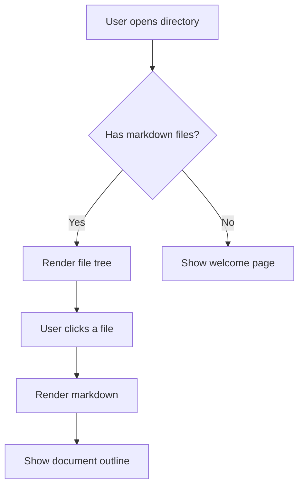
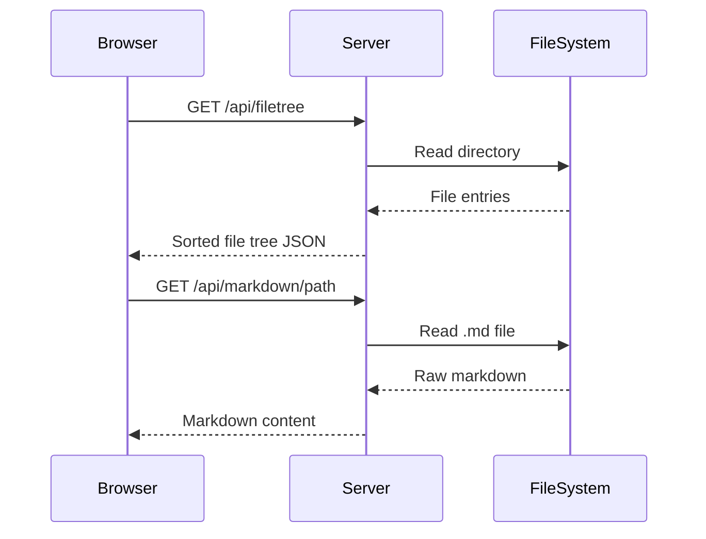
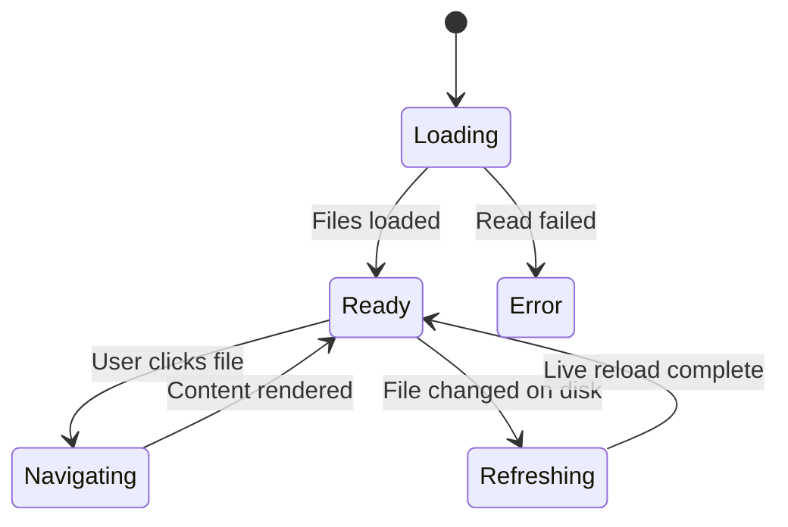
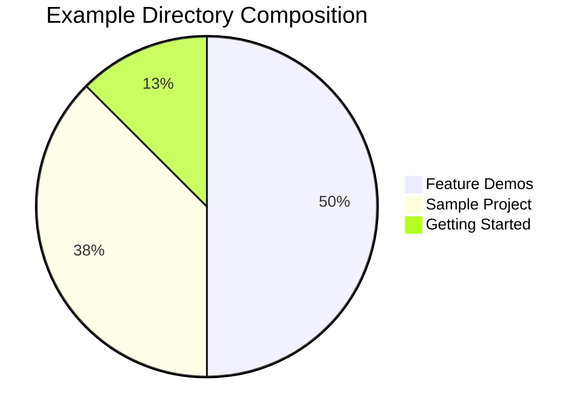

# Mermaid Diagrams

browsemark renders Mermaid diagrams inline. Navigate away from this page and come back — the diagrams re-render correctly every time.

## Flowchart

## Sequence Diagram

## State Diagram

## Pie Chart

## See Also

- [[architecture]] — Mermaid diagrams in a real project context
- [[_getting-started|Getting Started]] — Feature overview
