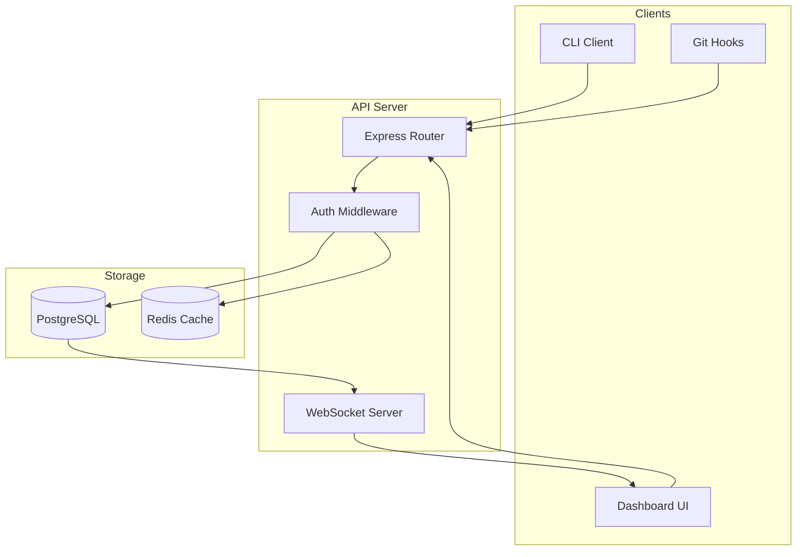
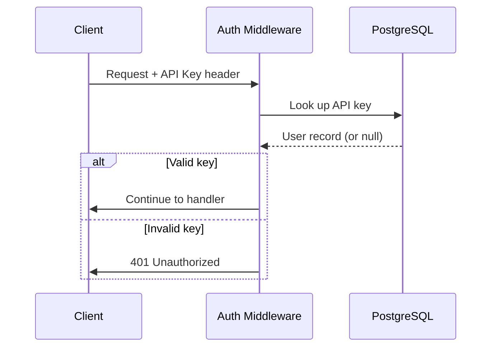
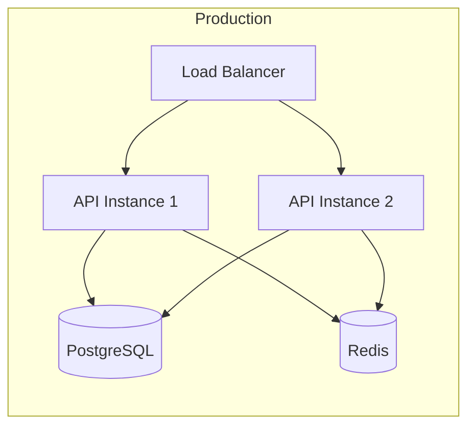

# TaskFlow — Architecture

> Part of the [[project-overview|TaskFlow PRD]]. This document covers system design, component interactions, and data flow.

## System Overview



## Component Breakdown

### API Server

The Express application handles REST requests and WebSocket connections:

| Component | Responsibility |
|-----------|---------------|
| Router | Route matching, request validation |
| Auth Middleware | API key verification, rate limiting |
| Task Controller | CRUD operations, business logic |
| WebSocket Server | Push notifications on task changes |

### Data Layer

PostgreSQL with the following schema approach:

```sql
CREATE TABLE tasks (
    id          UUID PRIMARY KEY DEFAULT gen_random_uuid(),
    title       TEXT NOT NULL,
    description TEXT,
    status      TEXT CHECK (status IN ('open', 'in_progress', 'done', 'archived')),
    priority    INTEGER DEFAULT 0,
    created_by  UUID REFERENCES users(id),
    created_at  TIMESTAMPTZ DEFAULT NOW(),
    updated_at  TIMESTAMPTZ DEFAULT NOW()
);
```

### Authentication Flow



## Key Decisions

- ==PostgreSQL over SQLite== — concurrent access needed for multi-user scenarios. See decision log in [[project-overview]].
- ==Redis for caching== — API key lookups cached for 5 minutes to reduce DB load.
- ==WebSocket over polling== — real-time updates for the dashboard without polling overhead.

## Deployment



## See Also

- [[project-overview]] — Requirements and timeline
- [[api-spec]] — Endpoint specifications
- [[_getting-started|Getting Started]] — Back to the example docs
