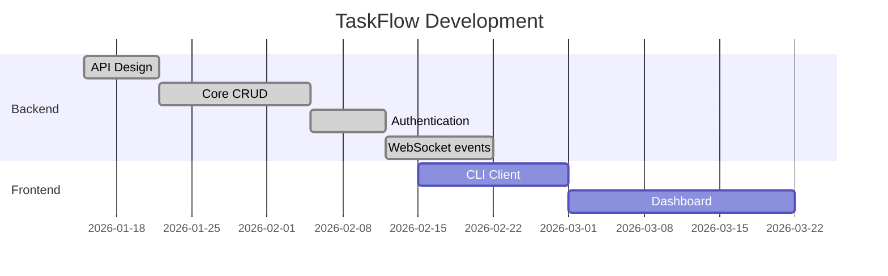

# TaskFlow — Project Overview

> This is a sample PRD (Product Requirements Document) demonstrating how teams keep specs as markdown in their codebase. Wiki-links connect related documents, making the spec set navigable.

## Problem Statement

Engineering teams lose context when specs live in Google Docs or Confluence, ==disconnected from the code they describe==. Developers switch between tools, copy-paste requirements, and work from stale documents.

## Proposed Solution

A lightweight task management API that teams can self-host. The core differentiator is ==tight integration with developer workflows== — CLI-first, git-friendly, markdown-native.

## Key Documents

| Document | Description |
|----------|-------------|
| [[architecture]] | System design, component diagram, data flow |
| [[api-spec]] | REST API endpoints, request/response schemas |

## Requirements

### Must Have (P0)

- REST API for task CRUD operations
- User authentication via API keys
- Markdown rendering for task descriptions
- WebSocket notifications for task updates

### Should Have (P1)

- CLI client for common operations
- Git hook integration (auto-close tasks on merge)
- ==Batch operations== for bulk task updates

### Nice to Have (P2)

- Dashboard UI
- Email notifications
- Third-party integrations (Slack, GitHub)

## Decision Log

| Decision | Date | Rationale |
|----------|------|-----------|
| Use PostgreSQL over SQLite | 2025-01-15 | Concurrent access, JSON columns, full-text search |
| REST over GraphQL | 2025-01-20 | Simpler client integration, team familiarity |
| API keys over OAuth | 2025-02-01 | ==Simpler for CLI usage==, OAuth deferred to P1 |

## Timeline

## See Also

- [[architecture|Architecture spec]] for the system design
- [[api-spec|API specification]] for endpoint details
- Back to [[_getting-started|Getting Started]]
